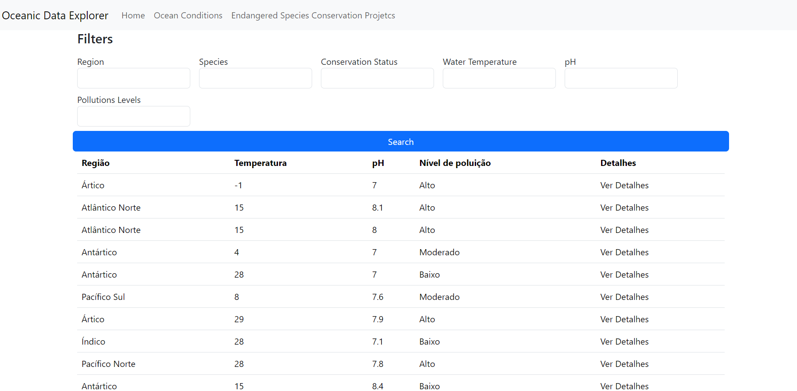
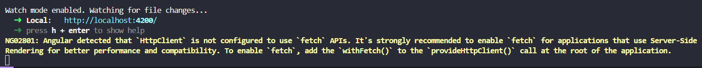
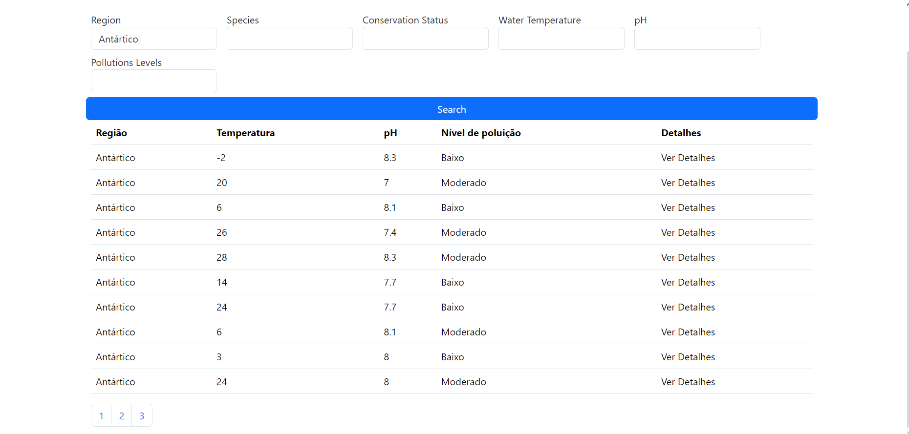

Membros:
Erik Giuseppe Kato Bandeira 92988,
João Tancredi Dela Rocca 93527,
Rafael Ioshi Imamura Pereira 93102.

Necessário baixar os pacotes antes de rodar, então para baixar os pacotes da aplicação é npm i.
Para executar o serve é ng serve.

